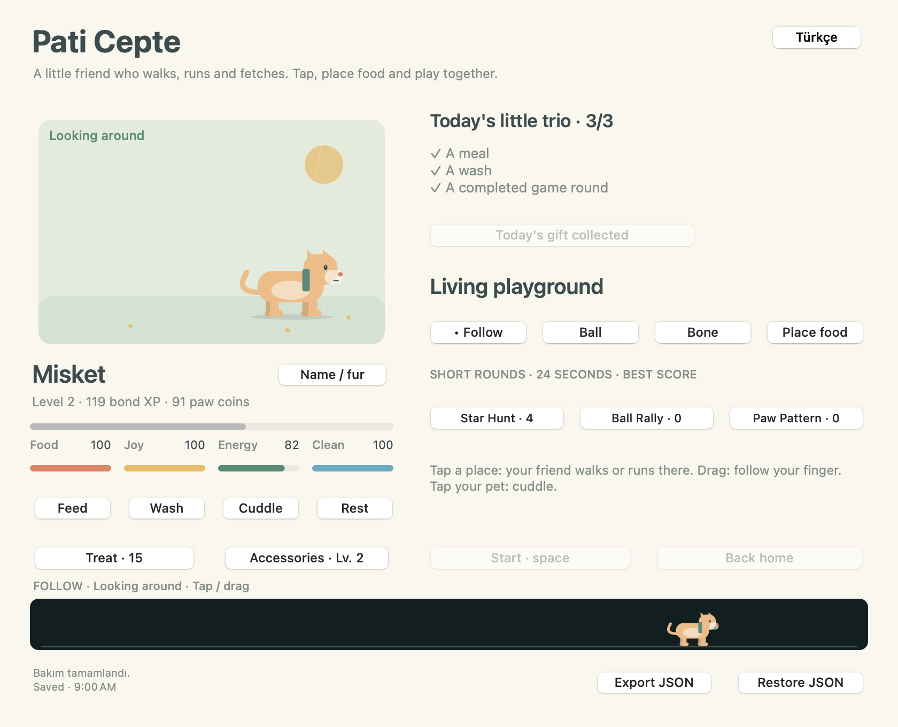

# Pati Cepte · Touch Bar Pet

**A little friend who lives in your Touch Bar.** Adopt a cat, dog or rabbit who walks, runs, follows your finger, fetches a thrown ball or bone and walks over to eat. Keep your saved progress and three short mini games.

[Download the Universal Mac app](https://github.com/metealpkarvan/touch-bar-pet/releases/latest) · [Türkçe kılavuz](README.tr.md) · [Report a bug](https://github.com/metealpkarvan/touch-bar-pet/issues)

[](https://github.com/metealpkarvan/touch-bar-pet/actions/workflows/ci.yml)



## A living playground · new in 1.1.0


| Tool | Interaction |
| --- | --- |
| **Follow** | Tap a destination to walk or run there; drag to follow your finger. Tap the pet itself to cuddle. |
| **Ball** | Throw a ball toward your touch. Your friend chases, picks it up and carries it back to the launch point. |
| **Bone** | Throw a bone, watch the chase and enjoy the return. Both toys are free. |
| **Place food** | Put a bowl anywhere. The pet walks over, lowers its head and eats before food and progress are saved. |

Choose a tool from the physical Touch Bar's **Follow / Ball / Bone / Place food** menu; it closes so you can tap the playground. The window strip and illustrated habitat use the same live world. After a short idle pause your friend wanders, turns, blinks and moves its paws and tail. The **Feed** care button places a bowl at another position automatically; washing and cuddling also have short interactions.

At home, **1–4** select tools, **← →** move the Follow target, **Space** taps the current position and **Escape / P** cancel a free-play interaction. Tap a sleeping pet or use **Wake** to wake it. The world stops advancing while the app is in the background or minimized.

Finished fetches apply the existing joy/care reward, including its 60-second XP limit. Free fetches do not replace the daily 24-second game-round goal. Canceled/replaced fetches and interrupted meals award nothing. A failed write exposes **Retry saving** for the completed interaction; retry cannot award it twice.

The animation uses actual native drawing and fictional records, not a recording of physical Touch Bar hardware. Reduce Motion disables decorative movement and autonomous roaming; explicit travel, fetch and feeding still work.

## Meet your friend

Choose a species, a fur color and a name. Feed, wash, cuddle and rest your pet. Meaningful care earns bond XP and a few paw coins. Level up to unlock a scarf, a star pendant and a crown; accessories do not cost coins.

Complete a meal, a wash and a game round to collect the day's optional little gift. Basic food and care are always free. An optional treat costs 15 paw coins. Your friend never dies, loses levels or asks you to maintain a streak. At most eight absent hours affect their needs; earned XP, coins, accessories and scores stay yours.

## Three games, one narrow playground

Each round lasts **24 active seconds**. Switching apps or minimizing pauses the round; tap to resume. Completed rounds grant a modest reward even with no points.

| Game | Touch Bar | Window / keyboard |
| --- | --- | --- |
| Star Hunt | Tap stars or drag to catch them | Click/drag, or ← → and Space |
| Ball Rally | Tap while the ball is in the green zone | Click anywhere or Space at the right time |
| Paw Pattern | Watch the lit sequence, then repeat it on four pads | Click the pads or use 1–4 |

**P** pauses or resumes. **Escape** pauses. Select another game or return home to leave an unfinished round; its reward is not awarded. Your completed progress remains saved.


These images are exported from the actual AppKit Touch Bar views. They are previews, not photos of tested physical hardware.

## Download and keep playing

1. Download `TouchBarPet-v1.1.0-universal.zip` from [Releases](https://github.com/metealpkarvan/touch-bar-pet/releases/latest).
2. Extract it and move **Pati Cepte.app** into Applications. Open it and select **Choose pet**.
3. Keep playing. Each care action, identity change, daily gift and completed round saves automatically. Closing and reopening the app preserves your friend.

**Requirements:** macOS 11 or later. The same Universal app includes Intel `x86_64` and Apple Silicon `arm64`. No Rosetta, Xcode, package manager, account or internet connection is required to play. Macs without a Touch Bar can use the window playground.

The app uses Apple's public app-controlled Touch Bar. Bring Pati Cepte to the foreground and choose **App Controls** in your Mac's Touch Bar settings. The Control Strip remains managed by macOS. Other apps can show their own bars when they are frontmost. [Apple's Touch Bar guide](https://support.apple.com/guide/mac-help/customize-the-touch-bar-mchl5a63b060/mac)

### First open

The release is ad-hoc signed for integrity; **it is not Developer ID signed or notarized by Apple**. macOS may block its first launch. If you trust this release, follow [Apple's instructions for opening an app from an unidentified developer](https://support.apple.com/102445), using Privacy & Security → Open Anyway after your first attempt. Keep Gatekeeper enabled. You can also build from the published source.

The release includes `SHA256SUMS.txt`. Verify the ZIP in the same folder:

```bash
shasum -a 256 -c SHA256SUMS.txt
```

## Your progress lives on your Mac

**Upgrading from 1.0.0:** close the older app and open the new `.app`. The save folder and version-1 JSON format are unchanged; identity, levels, coins, accessories and scores remain compatible. Transient walking positions, airborne toys and unfinished meals restart on reopening; completed care/fetch gains remain saved.

The save is `~/Library/Application Support/TouchBarPet/pet.json`. Each save keeps the previous valid revision as `pet.previous.json`. Files are written atomically. If the primary is unreadable, the app protects it and offers explicit recovery from a valid previous revision. Recovery preserves the unreadable raw file separately.

Use **Export JSON** for a portable backup; **Restore JSON** validates the whole file before replacing the local pet. Restoring requires confirmation, retains a recovery copy and does not merge pets. Backups are limited to 1 MB. Your name, species, fur, needs, resting state, XP, coins, accessories, best scores, recent journal and daily progress are included. The short, unfinished round itself is not saved.

There is one pet per macOS user profile. Saves are not encrypted or synchronized. Removing the app does not remove its Application Support save. Clearing that folder removes progress, so export a backup first. The app makes no network requests, has no ads or analytics and does not request notification or login permissions. The explicit Source menu opens GitHub in your browser.

## Build and verify

Requires Swift 5.7+ and a macOS SDK on a compatible build Mac. Command Line Tools are sufficient; full Xcode is optional.

```bash
git clone https://github.com/metealpkarvan/touch-bar-pet.git
cd touch-bar-pet
swift run TouchBarPet
swift run PetRulesTests
swift run TouchBarPet --smoke-test --screenshots output/verification
bash scripts/package.sh 1.1.0
```

The core checks cover persistence/reopen, corrupt-record protection, raw recovery, backup validation, clocks, care and reward bounds, accessory unlocks and all three games. The AppKit acceptance path drives real native controls and Touch Bar item callbacks against temporary fictional records. CI runs on native Intel and arm64 Mac hosts, then verifies the Universal package.

Physical finger input and every older macOS/device combination still need [manual hardware checks](docs/HARDWARE-CHECKLIST.md). macOS 11 is the deployment target, not a claim that every supported device has been tested. See [verification](docs/VERIFICATION.md), [design](docs/DESIGN.md), [architecture](docs/ARCHITECTURE.md) and [roadmap](docs/ROADMAP.md).

Original vector art is drawn in AppKit; there are no third-party runtime libraries or downloaded art assets.

MIT © 2026 Mete Alp Karvan
