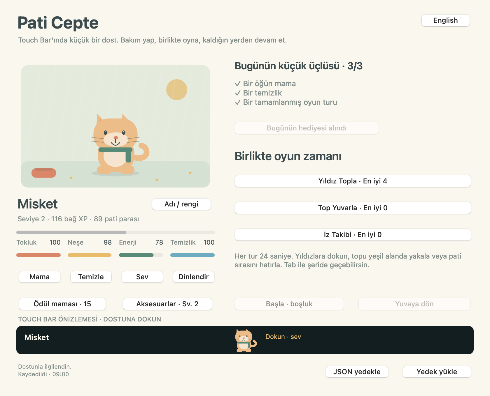

# Pati Cepte · Touch Bar evcil hayvan oyunu

**Küçük bir dost, biraz oyun.** MacBook Pro Touch Bar’ında kedi, köpek veya tavşan sahiplen; besle, temizle, sev ve birlikte üç mini oyun oyna.

[Mac uygulamasını indir](https://github.com/metealpkarvan/touch-bar-pet/releases/latest) · [English](README.md)



## Nasıl oynanır?

İlk açılışta **Dost seç** düğmesinden türünü, rengini ve adını seç. **Mama**, **Temizle**, **Sev** ve **Dinlendir** ile ilgilen. Dinlenirken enerji zamanla dolar; oyun için **Uyandır**’a dokun.

Anlamlı bakım bağ XP’si ve küçük miktarda pati parası kazandırır. Seviye 2’de fular, 3’te yıldız ve 5’te taç açılır. Aksesuarlar ücretsizdir. Temel mama ve bakım her zaman ücretsiz; isteğe bağlı ödül maması 15 pati parasıdır.

Bir öğün mama, bir temizlik ve tamamlanmış oyun turuyla günün küçük üçlüsünü bitirebilirsin. Hediyeyi kendin toplarsın: +40 para ve +20 XP. Bir gün kaçırırsan seviye veya birikimin silinmez; devamlı giriş zorunluluğu yoktur. Dostun ölmez. Uygulama kapalıyken en fazla sekiz saatlik ihtiyaç değişimi uygulanır; XP, para ve en iyi skorlar korunur.

| Oyun | Yapacağın şey |
| --- | --- |
| Yıldız Topla | Yıldızlara dokun veya parmağını sürükle; masaüstünde ← → ve boşluk da çalışır. |
| Top Yuvarla | Top yeşil alanın içindeyken şeride veya boşluğa dokun. |
| İz Takibi | Parlayan dört alanın sırasını izle, sonra aynı sırayı dokunarak veya 1–4 ile tekrarla. |

Her tur **24 etkin saniye** sürer. **P** duraklatır/devam ettirir; **Escape** duraklatır. Başka uygulamaya geçince veya pencereyi küçültünce oyun durur. Geri geldiğinde dokunarak devam edersin. Bitmiş tur puan olmasa da küçük ödül verir; yarım bırakılan tur ödül vermez.

## İndir ve kur

1. [Releases](https://github.com/metealpkarvan/touch-bar-pet/releases/latest) sayfasından `TouchBarPet-v1.0.0-universal.zip` indir.
2. ZIP’i aç; **Pati Cepte.app** uygulamasını Uygulamalar klasörüne taşı ve çalıştır.
3. Dostunu seç. Bakım, isim/renk değişikliği, günlük hediye ve tamamlanan oyun turu otomatik kaydedilir.

**macOS 11+**, **Intel** ve **Apple Silicon** desteklenir. Aynı Universal dosyada iki işlemci dilimi vardır. Rosetta, Xcode veya internet gerekmez. Touch Bar olmayan Mac’lerde pencere içindeki oyun şeridi aynı oyunları çalıştırır.

Touch Bar’da görünmesi için uygulama önde olmalı ve klavye ayarlarında **Touch Bar shows → App Controls** seçilmelidir. Uygulama diğer programların Touch Bar’ını değiştirmez; macOS Kontrol Şeridi normal çalışır. [Apple’ın ayar kılavuzu](https://support.apple.com/guide/mac-help/customize-the-touch-bar-mchl5a63b060/mac)

Paket bütünlüğü için ad-hoc imzalanmıştır; **Apple Developer ID imzası ve notarizasyonu yoktur**. İlk açılış engellenirse yalnız bu sürüme güvendiğinde ilk denemeden sonra Sistem Ayarları → Gizlilik ve Güvenlik → Yine de Aç yolunu kullanabilirsin. [Apple’ın resmi açıklaması](https://support.apple.com/102445). Gatekeeper’ı genel olarak kapatma. İstersen açık kaynak kodundan derle.

## Her açılışta aynı dost

Kayıt: `~/Library/Application Support/TouchBarPet/pet.json`.

Ad, tür, renk, ihtiyaçlar, dinlenme durumu, seviye XP’si, para, aksesuar, en iyi skorlar ve günlük ilerleme korunur. Her yazmada önceki sağlam kayıt `pet.previous.json` olarak tutulur. Bozuk ana kayıt üzerine otomatik yazılmaz; önceki sağlam kayıt varsa **Kaydı kurtar** düğmesi gösterilir. Kurtarmada eski ham dosya ayrıca korunur.

**JSON yedekle** ile başka bir Mac’e taşınabilir kopya al. **Yedek yükle** bütün dosyayı doğrular, senden onay ister ve mevcut kaydı kurtarma kopyası olarak tutar. Yedekler birleşmez; en fazla 1 MB dosya alınır. Yarım kalmış 24 saniyelik oyun turu kaydedilmez; tamamlanan turların kazançları kaydedilir.

Bir macOS kullanıcı hesabında bir evcil hayvan vardır. Kayıt buluta gönderilmez veya şifrelenmez. Uygulamayı silmek kayıt klasörünü silmez. Kayıt klasörünü temizlemek ilerlemeyi kaldırır; önce JSON yedeği al. Reklam, telemetri, abonelik, bildirim izni veya kendiliğinden girişte çalıştırma yoktur.

## Kaynak kodu ve doğrulama

Swift 5.7+ ve macOS SDK’sı bulunan Mac’te:

```bash
git clone https://github.com/metealpkarvan/touch-bar-pet.git
cd touch-bar-pet
swift run TouchBarPet
swift run PetRulesTests
swift run TouchBarPet --smoke-test --screenshots output/verification
bash scripts/package.sh 1.0.0
```

Kayıt/kurtarma, ödül tekrarını engelleme, oyun ve saat kuralları otomatik kontrol edilir. AppKit kabul kontrolü gerçek düğmeleri ve Touch Bar geri çağrılarını geçici kurmaca kayıtlarla çalıştırır. Intel ve arm64 CI ayrı yapılır; Universal paketin dilimleri ayrıca doğrulanır.

Fiziksel Touch Bar’da parmak hassasiyeti ve her eski macOS/model birleşimi otomatik kontrolden çıkarılamaz. [Donanım kontrol listesi](docs/HARDWARE-CHECKLIST.md) ve [doğrulama sınırları](docs/VERIFICATION.md) depodadır. Görseller özgün AppKit vektör çizimleridir.

MIT © 2026 Mete Alp Karvan
