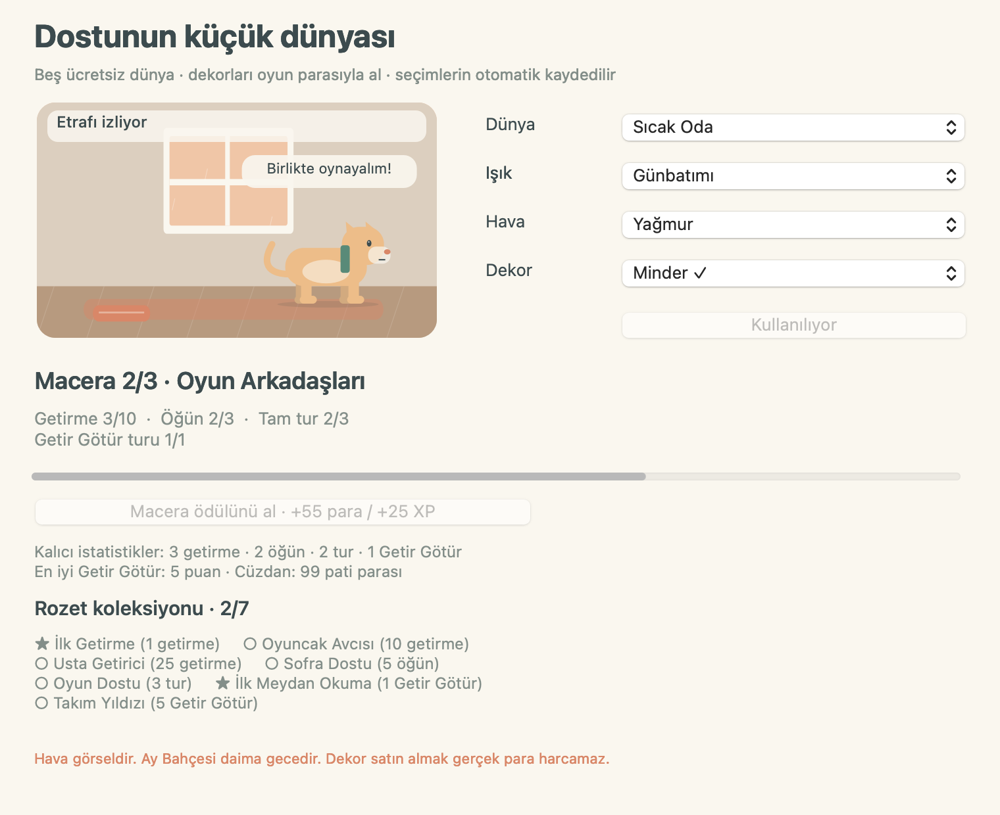

# Pati Cepte · Touch Bar evcil hayvan oyunu

**Touch Bar’ında yaşayan küçük bir dost.** Kedi, köpek veya tavşanın yürüsün, koşsun, parmağını takip etsin; attığın topu/kemiği getirip bıraktığın mamayı yesin. Kendi dünyanı süsle, maceraları tamamla, rozet topla; dört kısa oyunda ilerleyişin kayıtlı kalsın.

[Mac uygulamasını indir](https://github.com/metealpkarvan/touch-bar-pet/releases/latest) · [English](README.md)


## Küçük dünyanı tasarla · yeni 1.2.0


**Dünya** veya **Macera** düğmesinden **Pati Dünyası** açılır. **Bahçe, Sahil, Sıcak Oda, Ay Bahçesi ve Kar Yaylası** başlangıçtan itibaren ücretsizdir. Gündüz, günbatımı, gece; açık hava, yağmur veya kar seçebilirsin. Masaüstü ve Touch Bar aynı seçimi gösterir; yeniden açtığında dünya korunur. Ay Bahçesi daima gecedir, odadaki yağış pencerenin arkasında kalır. Hava seçenekleri görseldir; internetten hava durumu alınmaz.

Kazandığın pati parasıyla **minder (35), çiçek (50), fener (70) veya çadır (95)** al. Dekorlara bakmak para harcamaz; **Satın al ve yerleştir** fiyatı açıkça gösterir. Aldığın dekoru tekrar takmak ücretsizdir. Gerçek para kullanılmaz.

**Üç kalıcı macera**, bitmiş getirmeleri, öğünleri, turları ve Getir Götür oyunlarını takip eder. Bölüm hediyeleri sırayla, yalnız bir kez alınır. **Yedi rozet**, kalıcı istatistikler ve en iyi puan da kayıtlıdır. Yeni ömürlük sayaçlar bu güncellemede sıfırdan başlar; önceki dostun ve kazanımları korunur.

**Getir Götür**, yeni **30 etkin saniyelik** oyun. Masaüstünden veya Touch Bar’ın Pati menüsünden seçip şeride dokunarak başla. Altın hedef bölgesine top veya kemik at; dostun alıp geri getirsin. Tam getirme **+3**, hedefe isabetli getirme **+5 puan** verir. Her dönüşte hedef değişir. Duraklatınca hayvan ve sayaç birlikte durur. Bitmiş tur günlük oyun hedefine sayılır; `8 + min(40, puan)` para, `8 + min(25, puan / 2)` XP kazandırır. Süre bittiğinde henüz geri gelmeyen oyuncak puan vermez.



## Canlı Touch Bar oyun alanı


| Araç | Dokunduğunda olan şey |
| --- | --- |
| **Takip** | Dokunduğun yere yürür; uzaksa koşar. Parmağını sürüklediğinde yön değiştirip takip eder. Dostunun üzerine dokununca sevilir. |
| **Top** | Top dokunduğun yere havada gider. Dostun koşup alır, ağzında başlangıç noktasına geri getirir ve sevinir. |
| **Kemik** | Kemiği at, peşinden koşmasını ve geri getirmesini izle. Top ve kemik ücretsizdir. |
| **Mama bırak** | Seçtiğin noktaya bir kap bırak. Dostun oraya yürür, başını eğip yer; tokluk ancak yemek bitince kaydedilir. |

Touch Bar’da **Takip / Top / Kemik / Mama bırak** menüsünden aracı seç; menü kapandıktan sonra şeride dokun. Pencere içindeki şerit ve büyük sahne aynı hareketleri paylaşır. Boşta biraz bekleyince kendi kendine gezintiye çıkar; yönüne göre döner, patileri ve kuyruğu hareket eder, göz kırpar. **Mama** bakım düğmesi kabı otomatik olarak başka bir noktaya koyar. **Temizle** ve **Sev** de kısa bir etkileşimle tamamlanır.

Serbest alanda **1–4** araç seçer, Takip modunda **← →** hedefi taşır, **boşluk** mevcut noktaya dokunur. **Escape / P** devam eden serbest etkileşimi iptal eder. Dinlenen dostuna dokunarak veya **Uyandır** ile uyandırabilirsin. Uygulama arka plandayken veya küçültüldüğünde canlı alan ilerlemez.

Getirme tamamlanınca neşe/bakım ödülü uygulanır; aynı bakımın 60 saniyelik XP sınırı korunur. Serbest getirme günlük tur yerine geçmez; tamamlanan Getir Götür oyunu günlük hedefe sayılır. İptal edilen/yeni oyuncakla değiştirilen getirme ve yarım kalan yemek ödül vermez. Yazma hatasında **Kaydetmeyi yeniden dene** son tamamlanan etkileşimi bir kez kaydeder.

Animasyon gerçek uygulama çizimlerinden, kurmaca kayıtlarla üretilmiştir; fiziksel Touch Bar çekimi değildir. Hareketi Azalt ayarı süs hareketlerini ve kendiliğinden gezintiyi kapatır; açıkça istediğin hedefe gitme, getirme ve yeme çalışmaya devam eder.

## Nasıl oynanır?

İlk açılışta **Dost seç** düğmesinden türünü, rengini ve adını seç. **Mama**, **Temizle**, **Sev** ve **Dinlendir** ile ilgilen. Dinlenirken enerji zamanla dolar; oyun için **Uyandır**’a dokun.

Anlamlı bakım bağ XP’si ve küçük miktarda pati parası kazandırır. Seviye 2’de fular, 3’te yıldız ve 5’te taç açılır. Aksesuarlar ücretsizdir. Temel mama ve bakım her zaman ücretsiz; isteğe bağlı ödül maması 15 pati parasıdır.

Bir öğün mama, bir temizlik ve tamamlanmış oyun turuyla günün küçük üçlüsünü bitirebilirsin. Hediyeyi kendin toplarsın: +40 para ve +20 XP. Bir gün kaçırırsan seviye veya birikimin silinmez; devamlı giriş zorunluluğu yoktur. Dostun ölmez. Uygulama kapalıyken en fazla sekiz saatlik ihtiyaç değişimi uygulanır; XP, para ve en iyi skorlar korunur.

| Oyun | Yapacağın şey |
| --- | --- |
| Yıldız Topla | Yıldızlara dokun veya parmağını sürükle; masaüstünde ← → ve boşluk da çalışır. |
| Top Yuvarla | Top yeşil alanın içindeyken şeride veya boşluğa dokun. |
| İz Takibi | Parlayan dört alanın sırasını izle, sonra aynı sırayı dokunarak veya 1–4 ile tekrarla. |

Tablodaki üç mini oyunun her turu **24 etkin saniye** sürer. **P / Escape** süreli turu duraklatır veya devam ettirir. Başka uygulamaya geçince veya pencereyi küçültünce oyun durur. Geri geldiğinde dokunarak devam edersin. Bitmiş tur puan olmasa da küçük ödül verir; yarım bırakılan tur ödül vermez.

## İndir ve kur

1. [Releases](https://github.com/metealpkarvan/touch-bar-pet/releases/latest) sayfasından `TouchBarPet-v1.2.0-universal.zip` indir.
2. ZIP’i aç; **Pati Cepte.app** uygulamasını Uygulamalar klasörüne taşı ve çalıştır.
3. Dostunu seç. Bakım, isim/renk değişikliği, günlük hediye ve tamamlanan oyun turu otomatik kaydedilir.

**macOS 11+**, **Intel** ve **Apple Silicon** desteklenir. Aynı Universal dosyada iki işlemci dilimi vardır. Rosetta, Xcode veya internet gerekmez. Touch Bar olmayan Mac’lerde pencere içindeki oyun şeridi aynı oyunları çalıştırır.

Touch Bar’da görünmesi için uygulama önde olmalı ve klavye ayarlarında **Touch Bar shows → App Controls** seçilmelidir. Uygulama diğer programların Touch Bar’ını değiştirmez; macOS Kontrol Şeridi normal çalışır. [Apple’ın ayar kılavuzu](https://support.apple.com/guide/mac-help/customize-the-touch-bar-mchl5a63b060/mac)

Paket bütünlüğü için ad-hoc imzalanmıştır; **Apple Developer ID imzası ve notarizasyonu yoktur**. İlk açılış engellenirse yalnız bu sürüme güvendiğinde ilk denemeden sonra Sistem Ayarları → Gizlilik ve Güvenlik → Yine de Aç yolunu kullanabilirsin. [Apple’ın resmi açıklaması](https://support.apple.com/102445). Gatekeeper’ı genel olarak kapatma. İstersen açık kaynak kodundan derle.

## Her açılışta aynı dost

**1.0/1.1’den güncelleme:** Önce eski uygulamayı kapat; istersen JSON yedeğini al, ardından yeni `.app` dosyasını aç. Aynı kayıt klasörü kullanılır. Sürüm-1 kayıtları otomatik olarak sürüm 2’ye taşınır; dostun, XP, para, aksesuar, puanlar ve günlük ilerleme korunur. İlk yeni yazmada önceki ham kayıt tutulur. Eski uygulamalar yeni biçimi okuyamaz; 1.2 veya sonrası ile devam et. Bilerek eski sürüme dönmek için önceden ayrıca dışa aktardığın eski JSON yedeğini kullan. Yeni kalıcı sayaçlar sıfırdan başlar; gezinti konumu, havadaki oyuncak ve yarım turlar yeniden açılışta sıfırlanır.

Kayıt: `~/Library/Application Support/TouchBarPet/pet.json`.

Ad, tür, renk, ihtiyaçlar, dinlenme durumu, seviye XP’si, para, aksesuar, en iyi skorlar, günlük ilerleme, dünya seçimleri, alınan dekorlar, kalıcı istatistikler ve macera ödülleri korunur. Her yazmada önceki sağlam kayıt `pet.previous.json` olarak tutulur. Bozuk ana kayıt üzerine otomatik yazılmaz; önceki sağlam kayıt varsa **Kaydı kurtar** düğmesi gösterilir. Kurtarmada eski ham dosya ayrıca korunur.

**JSON yedekle** ile başka bir Mac’e taşınabilir kopya al. **Yedek yükle** bütün dosyayı doğrular, senden onay ister ve mevcut kaydı kurtarma kopyası olarak tutar. Yedekler birleşmez; en fazla 1 MB dosya alınır. Yarım kalmış 24/30 saniyelik oyun turları kaydedilmez; tamamlanan turların kazançları kaydedilir.

Bir macOS kullanıcı hesabında bir evcil hayvan vardır. Kayıt buluta gönderilmez veya şifrelenmez. Uygulamayı silmek kayıt klasörünü silmez. Kayıt klasörünü temizlemek ilerlemeyi kaldırır; önce JSON yedeği al. Reklam, telemetri, abonelik, bildirim izni veya kendiliğinden girişte çalıştırma yoktur.

## Kaynak kodu ve doğrulama

Swift 5.7+ ve macOS SDK’sı bulunan Mac’te:

```bash
git clone https://github.com/metealpkarvan/touch-bar-pet.git
cd touch-bar-pet
swift run TouchBarPet
swift run PetRulesTests
swift run TouchBarPet --smoke-test --screenshots output/verification
bash scripts/package.sh 1.2.0
```

Kayıt/kurtarma, ödül tekrarını engelleme, oyun ve saat kuralları otomatik kontrol edilir. AppKit kabul kontrolü gerçek düğmeleri ve Touch Bar geri çağrılarını geçici kurmaca kayıtlarla çalıştırır. Intel ve arm64 CI ayrı yapılır; Universal paketin dilimleri ayrıca doğrulanır.

Fiziksel Touch Bar’da parmak hassasiyeti ve her eski macOS/model birleşimi otomatik kontrolden çıkarılamaz. [Donanım kontrol listesi](docs/HARDWARE-CHECKLIST.md) ve [doğrulama sınırları](docs/VERIFICATION.md) depodadır. Görseller özgün AppKit vektör çizimleridir.

MIT © 2026 Mete Alp Karvan
